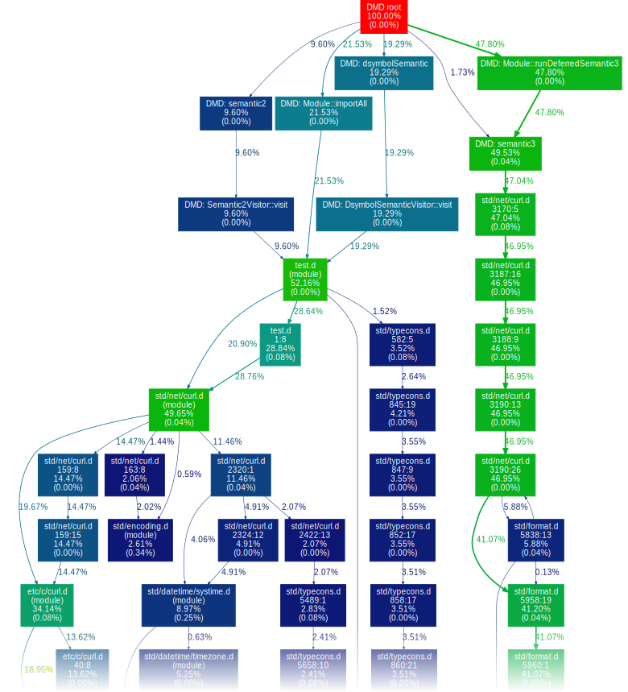

DMDProf
=======

Compilation time is rather interesting to D programmers.
Walter Bright [designed](https://forum.dlang.org/post/hptdvo$kem$1@digitalmars.com) the language (among other things) to compile quickly 
(especially [compared to C++](http://www.drdobbs.com/cpp/c-compilation-speed/228701711)), 
and DMD, the reference D compiler implementation, is itself quite optimized.

Direct quote from a colleague (after a long day of bisecting a regression in Clang, each step taking close to an hour):

> Whaaaaaaaaaaat? How can a compiler compile in 3 seconds?!?

Indeed, a clean build of DMD itself (about 170'000 lines of D and 120'000 lines of C/C++) takes no longer than 4 seconds to build on a rather average developer machine.

Walter bright has [long](https://forum.dlang.org/search?q=group:digitalmarsD%20author:Walter%20author:Bright%20content:profiler) touted the importance of using profilers.
Though we have plenty of the kind that instrument or [sample](https://github.com/VerySleepy/verysleepy) the program being profiled, 
including [one in DMD itself](https://dlang.org/dmd-linux.html#switch-profile), there aren't as many of the kind that allow profiling the input data, i.e. D programs.
Generic tools of [reducing input data sets according to some condition](https://github.com/CyberShadow/DustMite) are theoretically applicable, 
but specialized tools are generally much more effective.

One such tool is [DBuildStat](https://github.com/CyberShadow/DBuildStat), which enumerates the list of modules used in a program,
and then proceeds to collect various metrics about their compilation time.
The subject came up recently in the discussion of Phobos pull request #5916, "[Add a global convenience package file](https://github.com/dlang/phobos/pull/5916)";
a curious outlier was `std.net.curl`, which took an entire 40 milliseconds to import:

Though DBuildStat provided useful insight on a larger scale, it did not answer the question:
yes, but *why* does `std.net.curl` take an entire 40 milliseconds to import?

In theory, we could do something like this:

- Start compiling the D code;
- Stop the compiler at an arbitrary point;
- Look at its stack trace and see what code it was compiling at that time;
- Resume the compilation;
- Repeat the steps above until a satisfactory number of samples has been gathered.

Well, putting theory to practice with
[a bit of GDB Python scripting](https://github.com/CyberShadow/dmdprof/blob/master/dmdprof.py),
[a dash of postprocessing](https://github.com/CyberShadow/dmdprof/blob/master/linkify.d),
[a healthy dose of visualization](https://github.com/jrfonseca/gprof2dot/),
and some obligatory GraphViz, we get something actually usable:

Click the above image to see the full graph, and to get hover tooltips and clickable hyperlinks.

Following the links is entertaining in seeing how Phobos modules interact
and [how deep some of these interactions go](https://github.com/dlang/phobos/pull/5916#issuecomment-362896993),
but also allows quickly identifying [immediately actionable improvements](https://github.com/dlang/phobos/pull/6122).

Source code and detailed usage instructions can be found on the GitHub repository:  
https://github.com/CyberShadow/dmdprof
